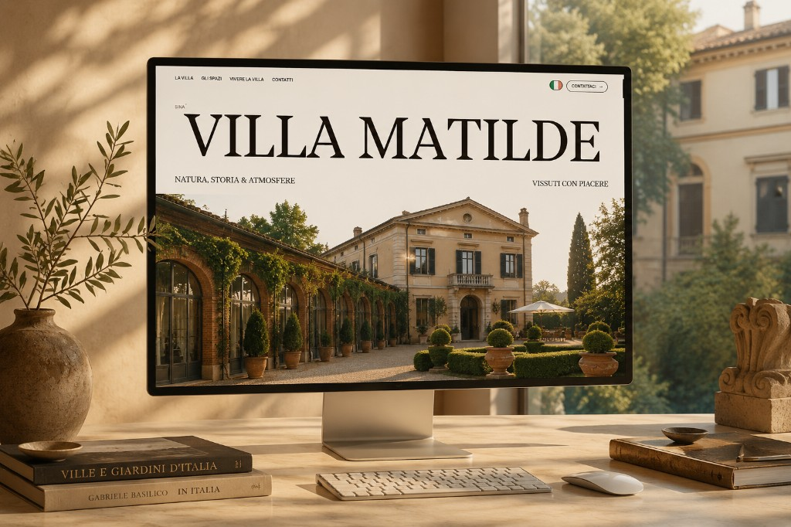

# Sina Villa Matilde

Demo site for [Sina Villa Matilde](https://www.sinahotels.com/it/h/sina-villa-matilde-torino/) — dimora d’epoca del XVIII secolo nel Canavese. Esperienza immersiva ispirata a portfolio Awwwards: tipografia editoriale, scroll fluido, animazioni GSAP.



## Stack

| Layer | Tech |
| --- | --- |
| UI | React 19 · Vite · TypeScript · Tailwind CSS v4 |
| Motion | GSAP · ScrollTrigger · Lenis |
| i18n | IT · EN · FR · DE · ES · RU · ZH |
| Routing | React Router (home + pagine spazi) |

## Avvio

```bash
cd web
npm install
npm run dev
```

Build di produzione:

```bash
cd web
npm run build
npm run preview
```

## Struttura

```
web/          App React (codice, media, i18n)
docs/         Asset di documentazione (preview repo)
inventory/    Inventario contenuti estratti
scripts/      Utility di crawl / download asset
```

## Note

- `prefers-reduced-motion` riduce animazioni e disattiva il cursore custom
- Media in `web/public/media/`
- Deploy Vercel: build da `web/` (vedi `vercel.json` in root)

## Repo

https://github.com/MichelBranche/demo-sina-villa-matilde
